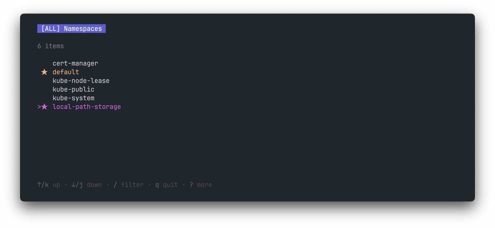

# client-go projects

Experiments with client-go in a mono-repo. I'm currently learning to write operators and interact with kubernetes using [client-go](https://github.com/kubernetes/client-go) and [kubebuilder](https://github.com/kubernetes-sigs/kubebuilder). You'll also find examples using Bubbletea, Cobra.


References:
- https://github.com/kubernetes/client-go/tree/master/examples (+ Docs).
- https://github.com/iximiuz/client-go-examples (+ Blog).
- https://github.com/viveksinghggits (+ Youtube).
- O'Reilly, Programming Kubernetes, 2019. 

## simple-deployment
Using clientset to create a deployment.
```
Creating deployment
created deployment "wills-demo-deployment"
Press the return key to continue.

Updating deployment
Press the return key to continue.

Listing deployments in namespace default
* busybox-sample (3 replicas)
* nginx (3 replicas)
* wills-demo-deployment (2 replicas)
  Press the return key to continue.

Deleting deployment
Deployment deleted :)
```

## simple-dynamic-deployment 
Using dynamic client, use of unstructured/gvr.
```
Creating deployment
created deployment "wills-demo-deployment"
Press the return key to continue.

Updating deployment
Press the return key to continue.

Listing deployments in namespace default
* busybox-sample (3 replicas)
* nginx (3 replicas)
* wills-demo-deployment (2 replicas)
  Press the return key to continue.

Deleting deployment
Deployment deleted :)
```

## informers
Basic implementation of a shared informer factory to monitor a configmap.

## get-namespace
Retrieve namespaces, display as a Tui using [Bubbletea](https://github.com/charmbracelet/bubbletea). 

- Press 'f' to favourite a namespace.
- Press 'tab' to switch to favourites view.
- Note: the default namespace is always a favourite.



## simple-workqueue
Implementation of controller, work queue, with comments. Remember, do not include retry logic as part of business logic.
```
I0620 16:35:26.946290   80354 controller.go:93] Starting pod controller
Sync/Add/Update for pod busybox-sample-74b4c7b6f6-4klrn
Sync/Add/Update for pod busybox-sample-74b4c7b6f6-bmbzh
Sync/Add/Update for pod busybox-sample-74b4c7b6f6-qd8ph
Sync/Add/Update for pod nginx-77b4fdf86c-8pkg5
Sync/Add/Update for pod nginx-77b4fdf86c-dndtp
Sync/Add/Update for pod nginx-77b4fdf86c-mkffs
Pod default/mypod does not exist anymore
```
```shell
kubectl create deployment mypod --image nginx
```
```
Sync/Add/Update for pod mypod-54dcbc4756-v5hmt
Sync/Add/Update for pod mypod-54dcbc4756-v5hmt
Sync/Add/Update for pod mypod-54dcbc4756-v5hmt
Sync/Add/Update for pod mypod-54dcbc4756-v5hmt
```

## incluster-config
Demonstration of in-cluster config.
```shell
GOOS=linux go build -o ./app .
docker build -t in-cluster .
kubectl create clusterrolebinding default-view --clusterrole=view --serviceaccount=default:default
kubectl run --rm -i demo --image=in-cluster
```

## kubectl-rest-mapper
Interact with kubectl, print GVR to stdout using templates.
```
GroupVersionResource
====================

Group:    apps
Version:  v1
Resource: deployments⏎
```

## kubectl-rest-mapper-tui (in-progress)
A tui version of kubectl-rest-mapper using [Cobra](https://cobra.dev/) and [Bubbletea](https://github.com/charmbracelet/bubbletea).

## nginx-mutating-webhook

## expose-controller (in progress)
Automatically create an Ingress for a given Deployment, credit to [viveksingh](https://github.com/viveksinghggits/ekspose/blob/master/controller.go) for the original implementation.

## now-what? (in progress)
You've deployed your first application to Kubernetes, you ask yourself "Now What?". Describes Kubernetes resources in a friendly way.

## kube-explain (in progress)
A cross between `kubectl explain` and `kubectl get` with resource information (parallels with now-what).

## custom-columns-query-builder (in progress)
Column builder for kubectl.
